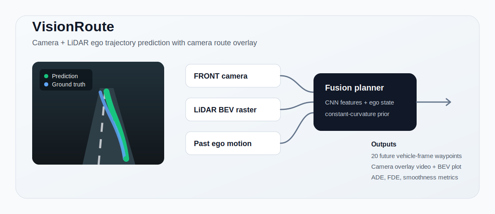
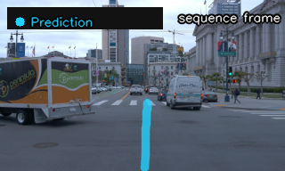

# VisionRoute: Waymo Camera + LiDAR Ego Trajectory Prediction



VisionRoute is a real-data autonomous-driving ML project that predicts the ego vehicle's future path from Waymo FRONT camera imagery, LiDAR point clouds, and past ego motion. It renders the predicted route back onto the camera stream as a navigation-style overlay and evaluates the model with trajectory metrics and non-neural baselines.

The repository is intentionally focused: one clean Waymo camera + LiDAR pipeline and no fake dataset success. If Waymo authentication or parsing dependencies are missing, the scripts fail with explicit setup instructions.

## Demo

[](https://raw.githubusercontent.com/nazar-110/vision-route-waymo/main/assets/demo/prediction_overlay.mp4)

- [Play the prediction overlay demo (MP4)](https://raw.githubusercontent.com/nazar-110/vision-route-waymo/main/assets/demo/prediction_overlay.mp4)
- [Bird's-eye-view trajectory comparison](assets/demo/bev_comparison.png)
- [Demo metrics JSON](assets/demo/sequence_metrics.json)

The included demo is a small Waymo Open Dataset extract used only for research illustration. Raw Waymo TFRecords, checkpoints, and full generated output folders are not committed.

## Highlights

- Real Waymo Open Dataset Perception TFRecord integration
- FRONT camera image extraction from contiguous driving segments
- LiDAR range image parsing with the official Waymo parser
- Vehicle-frame point cloud rasterization into compact BEV channels
- PyTorch camera + LiDAR + ego-motion trajectory planner
- Constant-velocity and constant-curvature baselines
- ADE, FDE, and smoothness metrics
- Camera projection from vehicle waypoints to image pixels
- Prediction-only and ground-truth-debug MP4 overlay rendering

## Architecture

```text
FRONT camera image -> camera CNN --------\
LiDAR BEV raster   -> LiDAR CNN ---------+-> fusion MLP -> 20 future waypoints
Past ego motion    -> ego-motion MLP ----/
```

The planner predicts `20` future `(x, y)` waypoints in vehicle coordinates:

- `x`: forward distance
- `y`: lateral offset, positive left

The neural decoder predicts a learned residual on top of a constant-curvature ego-motion rollout. That gives the model a strong onboard-motion prior while still allowing camera and LiDAR features to correct the route.

## Repository Layout

```text
configs/          experiment configuration
scripts/          setup, download, train, render, predict commands
src/data/         Waymo readers, calibration, transforms, LiDAR BEV
src/models/       image encoder, LiDAR encoder, ego encoder, planner, baselines
src/training/     training loop, evaluation, metrics
src/visualization camera overlay, BEV plot, MP4 rendering, inference entrypoint
tests/            geometry, projection, metrics, and TFRecord discovery tests
assets/           README graphics and a small attributed demo extract
```

Raw Waymo files, generated videos, metrics, and checkpoints are intentionally ignored by git.

## Setup

Windows users should parse Waymo TFRecords from WSL/Linux because the official Waymo wheel is distributed for Linux.

```bash
bash scripts/setup_wsl_waymo.sh
source ~/visionroute-py310/bin/activate
python scripts/check_environment.py
```

For a lightweight Python environment without Waymo parsing extras:

```bash
bash scripts/install_deps.sh
```

## Download Waymo Perception Segments

You must accept the [Waymo Open Dataset terms](https://waymo.com/open/terms) and authenticate with Google Cloud before downloading data.

```bash
gcloud auth login
gcloud auth application-default login
```

Download a small subset:

```bash
WAYMO_PERCEPTION_GCS_URI=gs://waymo_open_dataset_v_1_4_3/individual_files/validation \
  bash scripts/download_waymo_perception_subset.sh --split validation --num-files 4 --output data/raw/waymo_perception
```

The downloader discovers available TFRecords dynamically with `gsutil ls`; it does not hard-code Waymo split sizes or file counts.

## Train And Evaluate

```bash
bash scripts/train_waymo.sh
```

The default config trains on all downloaded segments except the last segment, then evaluates on the held-out segment.

Expected generated files:

```text
outputs/waymo_multimodal/checkpoints/best.pt
outputs/waymo_multimodal/metrics.json
outputs/waymo_multimodal/train_metrics.json
```

## Render Demo Videos

```bash
bash scripts/render_waymo_videos.sh
```

Expected generated files:

```text
outputs/video_gallery/train_segment_prediction_only.mp4
outputs/video_gallery/heldout_prediction_only.mp4
outputs/video_gallery/heldout_with_ground_truth_debug.mp4
outputs/video_gallery/waymo_sequence_prediction_only_first_frame.png
outputs/video_gallery/waymo_sequence_bev.png
```

Full generated videos and screenshots are not committed because they are derived from Waymo dataset content and can be regenerated locally after accepting Waymo's terms. The one-second H.264 preview under `assets/demo/` is an intentional lightweight exception.

## Predict On A New Waymo Segment

Run inference on any Waymo Perception TFRecord segment:

```bash
bash scripts/predict_waymo.sh data/raw/waymo_perception/segment-1024360143612057520_3580_000_3600_000_with_camera_labels.tfrecord
```

Outputs are written to:

```text
outputs/predictions/prediction_overlay.mp4
outputs/predictions/waymo_sequence_prediction_only_first_frame.png
outputs/predictions/waymo_sequence_bev.png
outputs/predictions/sequence_metrics.json
```

Raw MP4/JPG/PNG input is intentionally rejected by the default checkpoint. This project version is camera + LiDAR + ego-motion, so it requires Waymo TFRecord fields for LiDAR range images, camera calibration, and past ego poses. A raw-video-only version would require a separate camera-only model and assumed or estimated calibration.

## Metrics

VisionRoute reports:

- ADE: average displacement error
- FDE: final displacement error
- Smoothness: second-difference trajectory smoothness
- Baseline comparisons against constant velocity and constant curvature

Verified held-out result on a small four-segment local run:

| Model | ADE | FDE | Smoothness | Notes |
|---|---:|---:|---:|---|
| Camera + LiDAR residual planner | 1.063 | 3.117 | 0.0225 | Best checkpoint, anchored to curvature prior |
| Constant curvature | 1.063 | 3.117 | 0.0225 | Strong onboard-motion baseline |
| Constant velocity | 2.261 | 5.869 | 0.0000 | Straight-line extrapolation |

On this tiny subset, the learned residual did not beat the constant-curvature prior on the held-out drive, so the best checkpoint selected the epoch-0 prior. That is reported honestly instead of hidden.

## Projection Pipeline

Predicted waypoints are in Waymo vehicle coordinates. The visualization code:

1. Converts route waypoints into 3D vehicle-frame ground-plane points.
2. Applies the Waymo camera calibration abstraction.
3. Projects points into image pixels.
4. Filters points behind the camera.
5. Draws thick smoothed polylines, waypoint markers, frame text, and a legend.

Projection tests verify front/behind-camera filtering, left/right image behavior, horizon behavior, and visible overlay rendering.

## Tests

```bash
python -m pytest tests
```

Current upload-readiness check:

```text
11 passed
```

## GitHub Upload Notes

Before pushing:

```bash
git status --ignored
git add .gitattributes .gitignore LICENSE CITATION.cff README.md pyproject.toml assets configs data notebooks scripts src tests requirements*.txt environment.yml setup.sh setup_windows.ps1 outputs/README.md
git status
```

Do not commit:

- `data/raw/`
- `data/processed/`
- `outputs/waymo_multimodal/`
- `outputs/video_gallery/`
- `outputs/predictions/`
- `*.tfrecord`, `*.pt`, other generated `*.mp4` files, `__pycache__/`, `.pytest_cache/`

The `.gitignore` keeps those files out of git while explicitly allowing the small `assets/demo/prediction_overlay.mp4` preview.

## Dataset And Attribution

VisionRoute uses the [Waymo Open Dataset](https://waymo.com/open) and the official [waymo-open-dataset](https://github.com/waymo-research/waymo-open-dataset) parser. The code in this repository is MIT licensed, but the Waymo Open Dataset itself is governed by the separate Waymo Dataset License Agreement for Non-Commercial Use.

Required attribution:

> This software was made using the Waymo Open Dataset, provided by Waymo LLC under the Waymo Dataset License Agreement for Non-Commercial Use, available at waymo.com/open/terms, and your access and use of such work are governed by the terms and conditions therein.

## Future Work

- Train on 20-50 Waymo segments with several held-out drives.
- Train longer on GPU and compare against the constant-curvature prior.
- Add a temporal encoder over recent camera frames and LiDAR BEV frames.
- Add camera-only, LiDAR-only, and camera+LiDAR ablation configs.
- Add an optional camera-only inference mode for raw videos, clearly labeled as lower fidelity.
